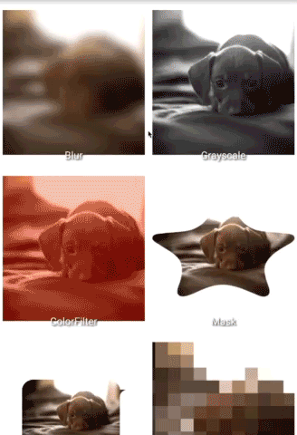

<table>
  <tr>
    <td>
        <h3>DEPRECATED</h3>
        Fresco Processors is deprecated. No more development will be taking place. For an up-to-date version,
        please use <a href="https://github.com/wasabeef/transformers">Transformers</a>. Thanks for all your support!
    </td>
  </tr>
</table>
<br/><br/>

Fresco Processors
======================
[](https://www.apache.org/licenses/LICENSE-2.0)
[](https://search.maven.org/artifact/jp.wasabeef/fresco-processors)

An Android image processor library providing a variety of transformations for [Fresco](https://github.com/facebook/fresco).

<p align="center">
  
</p>

#### Are you using Picasso or Glide?
[Picasso Transformations](https://github.com/wasabeef/picasso-transformations)  
[Glide Transformations](https://github.com/wasabeef/glide-transformations)

# Demo

### Original Image


### Processors


# How do I use it?

## Step 1

#### Gradle
```groovy
repositories {
  mavenCentral()
}

dependencies {
  implementation 'jp.wasabeef:fresco-processors:2.2.1'
  // If you want to use the GPU Filters
  implementation 'jp.co.cyberagent.android:gpuimage:2.1.0'
}
```

## Step 2

Set Fresco Postprocessor.

```java
ImageRequest request =
    ImageRequestBuilder.newBuilderWithResourceId(R.drawable.demo)
      .setPostprocessor(processor)
      .build();

PipelineDraweeController controller =
    (PipelineDraweeController) Fresco.newDraweeControllerBuilder()
      .setImageRequest(request)
      .setOldController(holder.drawee.getController())
      .build();
```

## Processors

### Color
`ColorFilterPostprocessor`, `GrayscalePostprocessor`

### Blur
`BlurPostprocessor`

### Mask
`MaskProcessors`

### GPU Filter (use [GPUImage](https://github.com/CyberAgent/android-gpuimage))
**Will require add dependencies for GPUImage.**  

`ToonFilterPostprocessor`, `SepiaFilterPostprocessor`, `ContrastFilterPostprocessor`  
`InvertFilterPostprocessor`, `PixelationFilterPostprocessor`, `SketchFilterPostprocessor`  
`SwirlFilterPostprocessor`, `BrightnessFilterPostprocessor`, `KuawaharaFilterPostprocessor`
`VignetteFilterPostprocessor`

## Combine Processors
```java
processor = new CombinePostProcessors.Builder()
                .add(new BlurPostprocessor(context))
                .add(new GrayscalePostprocessor())
                .build();
```

Developed By
-------
Daichi Furiya (Wasabeef) - <dadadada.chop@gmail.com>

<a href="https://twitter.com/wasabeef_jp">

</a>

Contributions
-------

Any contributions are welcome!

License
-------

    Copyright (C) 2020 Wasabeef

    Licensed under the Apache License, Version 2.0 (the "License");
    you may not use this file except in compliance with the License.
    You may obtain a copy of the License at

       http://www.apache.org/licenses/LICENSE-2.0

    Unless required by applicable law or agreed to in writing, software
    distributed under the License is distributed on an "AS IS" BASIS,
    WITHOUT WARRANTIES OR CONDITIONS OF ANY KIND, either express or implied.
    See the License for the specific language governing permissions and
    limitations under the License.
